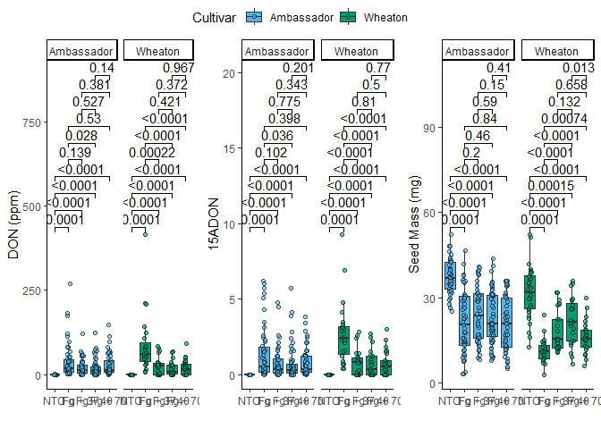

## R Markdown

1.  YAML header: top part of the markdown file that specifies the format
    of the document
2.  Literate programming: combination of English writing and code

# [Find data here](https://doi.org/10.1094/PDIS-06-21-1253-RE)

this is the code from coding challenge 3 question 5

    library(knitr)
    library(rmarkdown)
    library(pandoc)

    ## 
    ## Attaching package: 'pandoc'

    ## The following objects are masked from 'package:rmarkdown':
    ## 
    ##     pandoc_available, pandoc_convert, pandoc_version

    library(tidyverse)

    ## ── Attaching core tidyverse packages ──────────────────────── tidyverse 2.0.0 ──
    ## ✔ dplyr     1.1.4     ✔ readr     2.1.5
    ## ✔ forcats   1.0.0     ✔ stringr   1.5.1
    ## ✔ ggplot2   3.5.1     ✔ tibble    3.2.1
    ## ✔ lubridate 1.9.4     ✔ tidyr     1.3.1
    ## ✔ purrr     1.0.4

    ## ── Conflicts ────────────────────────────────────────── tidyverse_conflicts() ──
    ## ✖ dplyr::filter() masks stats::filter()
    ## ✖ dplyr::lag()    masks stats::lag()
    ## ℹ Use the conflicted package (<http://conflicted.r-lib.org/>) to force all conflicts to become errors

    library(ggrepel)
    library(ggpubr)
    library(tinytex)

    mycodata = read.csv("MycotoxinData.csv", na.strings = "na")
    View(mycodata)
    str(mycodata)

    ## 'data.frame':    375 obs. of  6 variables:
    ##  $ Treatment     : chr  "Fg" "Fg" "Fg" "Fg" ...
    ##  $ Cultivar      : chr  "Wheaton" "Wheaton" "Wheaton" "Wheaton" ...
    ##  $ BioRep        : int  2 2 2 2 2 2 2 2 2 3 ...
    ##  $ MassperSeed_mg: num  10.29 12.8 2.85 6.5 10.18 ...
    ##  $ DON           : num  107.3 32.6 416 211.9 124 ...
    ##  $ X15ADON       : num  3 0.85 3.5 3.1 4.8 3.3 6.9 2.9 2.1 0.71 ...

    mycodata$Treatment=as.factor(mycodata$Treatment)
    mycodata$Cultivar=as.factor(mycodata$Cultivar)
    str(mycodata)

    ## 'data.frame':    375 obs. of  6 variables:
    ##  $ Treatment     : Factor w/ 5 levels "Fg","Fg + 37",..: 1 1 1 1 1 1 1 1 1 1 ...
    ##  $ Cultivar      : Factor w/ 2 levels "Ambassador","Wheaton": 2 2 2 2 2 2 2 2 2 2 ...
    ##  $ BioRep        : int  2 2 2 2 2 2 2 2 2 3 ...
    ##  $ MassperSeed_mg: num  10.29 12.8 2.85 6.5 10.18 ...
    ##  $ DON           : num  107.3 32.6 416 211.9 124 ...
    ##  $ X15ADON       : num  3 0.85 3.5 3.1 4.8 3.3 6.9 2.9 2.1 0.71 ...

    cbbPalette <- c("#000000", "#E69F00", "#56B4E9", "#009E73", "#F0E442", "#0072B2", "#D55E00", "#CC79A7")
    colorchoice= c("#56B4E9","#009E73")

Graphs with DON

    mycodata$Treatment2= factor(mycodata$Treatment, levels= c("NTC","Fg","Fg + 37","Fg + 40","Fg + 70")) #new column with correct order
    graph2= ggplot(mycodata, aes(x=Treatment2, y=DON, fill=Cultivar)) + #uses corrected order
      geom_boxplot(position=position_dodge(0.5),outlier.color = "NA") +
      xlab("") + ylab("DON (ppm)") +
      geom_point(pch=21, alpha=0.6, position=position_jitterdodge(dodge.width=0.9)) +
      scale_fill_manual(values= colorchoice)+
      theme_classic()+
      facet_wrap(~Cultivar)
    graph5= graph2 + geom_pwc(aes(group=Treatment2, method= "t_test", label= "p.adj.format"))

    ## Warning in geom_pwc(aes(group = Treatment2, method = "t_test", label =
    ## "p.adj.format")): Ignoring unknown aesthetics: method

Graph with X15ADON

    graph3= ggplot(mycodata, aes(x=Treatment2, y=X15ADON, fill=Cultivar)) +
      geom_boxplot(position=position_dodge(0.5),outlier.color = "NA") +
      xlab("") + ylab("15ADON") +
      geom_point(pch=21, alpha=0.6, position=position_jitterdodge(dodge.width=0.9)) +
      scale_fill_manual(values= colorchoice)+
      theme_classic()+
      facet_wrap(~Cultivar)
    graph6= graph3 + geom_pwc(aes(group=Treatment2, method= "t_test", label= "p.adj.format"))

    ## Warning in geom_pwc(aes(group = Treatment2, method = "t_test", label =
    ## "p.adj.format")): Ignoring unknown aesthetics: method

    graph4= ggplot(mycodata, aes(x=Treatment2, y=MassperSeed_mg, fill=Cultivar)) +
      geom_boxplot(position=position_dodge(0.5),outlier.color = "NA") +
      xlab("") + ylab("Seed Mass (mg)") +
      geom_point(pch=21, alpha=0.6, position=position_jitterdodge(dodge.width=0.9)) +
      scale_fill_manual(values= colorchoice)+
      theme_classic()+
      facet_wrap(~Cultivar)
    graph7= graph4 + geom_pwc(aes(group=Treatment2, method= "t_test", label= "p.adj.format"))

    ## Warning in geom_pwc(aes(group = Treatment2, method = "t_test", label =
    ## "p.adj.format")): Ignoring unknown aesthetics: method

    ggarrange(graph5,graph6,graph7, ncol=3, nrow=1, common.legend = TRUE)

    ## Warning: Removed 8 rows containing non-finite outside the scale range
    ## (`stat_boxplot()`).

    ## Warning: Removed 8 rows containing non-finite outside the scale range
    ## (`stat_pwc()`).

    ## Warning: Removed 8 rows containing missing values or values outside the scale range
    ## (`geom_point()`).

    ## Warning: Removed 8 rows containing non-finite outside the scale range
    ## (`stat_boxplot()`).

    ## Warning: Removed 8 rows containing non-finite outside the scale range
    ## (`stat_pwc()`).

    ## Warning: Removed 8 rows containing missing values or values outside the scale range
    ## (`geom_point()`).

    ## Warning: Removed 10 rows containing non-finite outside the scale range
    ## (`stat_boxplot()`).

    ## Warning: Removed 10 rows containing non-finite outside the scale range
    ## (`stat_pwc()`).

    ## Warning: Removed 10 rows containing missing values or values outside the scale range
    ## (`geom_point()`).

    ## Warning: Removed 2 rows containing non-finite outside the scale range
    ## (`stat_boxplot()`).

    ## Warning: Removed 2 rows containing non-finite outside the scale range
    ## (`stat_pwc()`).

    ## Warning: Removed 2 rows containing missing values or values outside the scale range
    ## (`geom_point()`).

[github link
here](https://github.com/kingjad33/PLPA6820Class/tree/main/R%20markdown)
